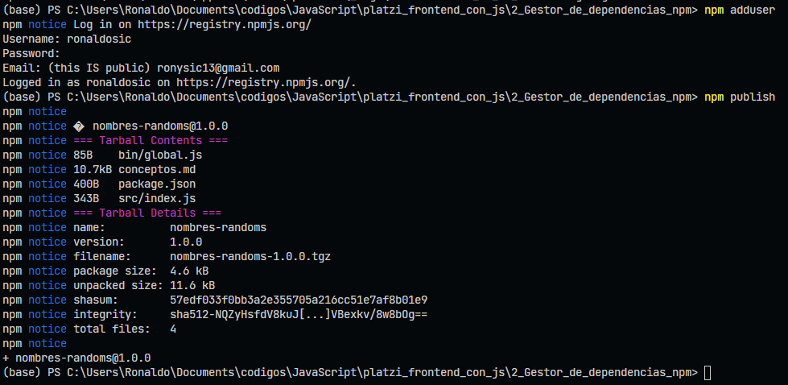

# Tabla de contenido

- [Tabla de contenido](#tabla-de-contenido)
- [1 Acerca de NPM, paquetes y módulos 1/15](#1-acerca-de-npm-paquetes-y-módulos-115)
- [2 Instalación en Windows 2/15](#2-instalación-en-windows-215)
- [3 Iniciar un proyecto 4/15](#3-iniciar-un-proyecto-415)
  - [3.1 Para inicializar un proyecto con npm y node hay 3 fomras que se pueden utilizar](#31-para-inicializar-un-proyecto-con-npm-y-node-hay-3-fomras-que-se-pueden-utilizar)
    - [3.1.1 npm init](#311-npm-init)
    - [3.1.2 npm init -y ó npm init -y](#312-npm-init--y-ó-npm-init--y)
    - [3.1.3 npm init -y con credenciales guardados previamente](#313-npm-init--y-con-credenciales-guardados-previamente)
- [4 Instalación de dependencias 5/15](#4-instalación-de-dependencias-515)
- [5 Instalación de dependencias con force 6/15](#5-instalación-de-dependencias-con-force-615)
- [6 Actualizar y eliminar paquetes 7/15](#6-actualizar-y-eliminar-paquetes-715)
- [7 Package lock y el uso los símbolos ^ y ~ 8/15](#7-package-lock-y-el-uso-los-símbolos--y--815)
- [8 Ejecutar tareas 9/15](#8-ejecutar-tareas-915)
- [9 Solución de problemas 10/15](#9-solución-de-problemas-1015)
- [10 Seguridad 11/15](#10-seguridad-1115)
- [11 Crear un paquete para NPM 12/15](#11-crear-un-paquete-para-npm-1215)
- [12 Publicar un paquete en NPM 13/15](#12-publicar-un-paquete-en-npm-1315)

# 1 Acerca de NPM, paquetes y módulos 1/15

**¿Qué es NPM (node package manager)?**

Es un gestor de paquetes, el más popular que tiene JavaScript, donde encontrarás una gran cantidad de recursos para poder implementar en tus proyectos. También vas a poder crear tus propios paquetes y compartirlos con toda la comunidad.

[NMP](https://www.npmjs.com/)

# 2 Instalación en Windows 2/15

Para poder intalar **nmp** hay que intalar **Node** que viene incluido en la misma instalación.

[Node](https://nodejs.org/es/)

Comando para comprobar e instalar las ultimas actualizaciones de npm por linea de comando.

```cmd
  npm install -g npm@latest
```

# 3 Iniciar un proyecto 4/15

`npm init`: Nos sirve para crear el archivo package.json el cual contiene toda la información acerca de nuestro proyecto, entre los datos que contiene son:

- **package name**, que es el nombre de tu proyecto.
- **version**, la versión en la que esta tu proyecto.
- **description**, sobre que trata nuestro proyecto.
- **entry point**, el punto de entrada de nuestro proyecto.
- **test command** u otros comandos de utilidad para nuestro proyecto.
- **gti repository**, el repositorio donde esta almacenado tu proyecto, podria ser github, gitlab, entre otros.
- **keywords**, son palabras que describen a nuestro proyecto
- **author**, quien esta desarrollando el proyecto aquí va nombre <email>

[Un ejemplo que encontre por ahi](https://github.com/jonschlinkert/even/blob/master/package.json)

[Tipos de licencias de software](https://es.wikipedia.org/wiki/Licencia_de_software)

## 3.1 Para inicializar un proyecto con npm y node hay 3 fomras que se pueden utilizar

### 3.1.1 npm init

Esta es la manera enstandar de inicializar un proyecto que nos permite dejar rellenar algunos campos con datos que nosotros queremos de nuestro proyecto, asi como el nombre, autor, correo y el tipo de licencia entre otros datos.

### 3.1.2 npm init -y ó npm init -y

En esta forma es como un shorthand que ya nos ayuda a autocompletar los datos y que podremos editar más adelate conforme va avanzando o requiramos cosas en el proyecto.

### 3.1.3 npm init -y con credenciales guardados previamente

Esta opción es similar a la de `npm init -y` solo que lo que varia es que los credenciales como lo es el autor, correo o el tipo de licencia ya los tenemos guardados y que se auto completa por si solo.

Para guardar los datos tenemos que hacer lo siguiente en la linea de comando.

```cmd
npm init.author.email "ronysic13@gmail.com"
npm init.author.name "Ronaldo Sic"
npm init.license "MIT"
# Despues de almacenar los dato seguimos con el siguiente codigo de npm
npm init -y

```


# 4 Instalación de dependencias 5/15

El comando para instalar paquetes es:

Instala un paquete de manera global, que estará diponible para todo el OS.

`npm install paquete -g`

Instala un paquete de manera de dependencia de desarrollo, que solo es para el proyecto que se esta trabajando.

`npm install paquete -D`

Comando para listar los paquetes instalados de fomra globla

`npm list -g --depth 0`

# 5 Instalación de dependencias con force 6/15

**Cuando queremos ver el output de una dependencia sin proceder con su instalación ejecutamos.**

`npm install name_package --dry-run`

**Instalar la última versión y desde los servidores de npm:**

`npm install webpack -f`
`npm install webpack --force`

**Instalar una versión exacta de un paquete:**

`npm install json-server@0.15.0`

**Simula la instalacion para tener un output para decidir si instalarlo.**

`npm install react --dry-run`

**Instalación forcada.**

`npm install webpack -f`

**Como reinstalar todos los paquetes y dependencias**

Este comando toma el archivo package.json e instala todo lo que tiene en el.
``npm install`

# 6 Actualizar y eliminar paquetes 7/15

**Actualizar paquetes**

**_Revisar que paquetes disponen de nuevas versiones, paquetes desactualizados_**

`npm outdate`

**_Para ver un output más detallado_**

`npm outdate --dd`

**_Actualizar los paquetes que no están en la ultima versión_**
`npm update`

**_Actualizar un paquete especifico_**
`npm install json-server@latest`

**Eliminar paquetes**

**_Eliminar un paquete de node_modules y del archivo package.json_**
`npm uninstall json-server`

**_Desinstalar un paquete de todo node_modules pero no del archivo package.json_**
`npm uninstall webpack --no-save`

# 7 Package lock y el uso los símbolos ^ y ~ 8/15

**^** = Si mantenemos el caret dentro de la configuración de nuestro package estamos garantizando que cuando realicemos una actualización o tengamos un cambio que podamos realizar, vamos a hacer actualización de los cambios menores y de los parches o bug fixes.
Para quedarnos en una sola versión eliminamos el caret.

**~** = Establece que vamos a recibir actualizaciones o cambios solamente de los cambios que son parches o bug fixes.

# 8 Ejecutar tareas 9/15

Puedes también especificar scripts con el prefijo “pre” que se ejecutarán automáticamente antes del comando que ejecutaste. Por ejemplo, si defines el comando **build** y **prebuild**, cuando corras `npm run build` el comando **prebuild** se ejecutará primero. Esto sirbe para poder ejecutar tareas que hagan algún tipo de preparación necesaria para correr el comando principal.

Sin embargo, hay que hacer notar que si el comando pre falla (retorna un valor que no es 0) el comando principal no se ejecutará. Esto es algo bueno ya que si nuestro proceso de preparación no se realiza de forma exitosa, puede que tengamos problemas al querer ejecutar la tarea principal.

En algunas ocaciones, sin embargo, la tarea previa puede fallar sin que eso afecte la ejecución de la tarea principal. En esos casos puedes usar `||` exit `0` para retornar `0`:

```cmd
"presass-build": "(rm css/*.css; rm css/*.css.map) || exit 0"
```

Ese es un ejemplo de un comando que hice hace un tiempo. **rm** puede fallar si el directorio css está vacio, y en ese caso no hay problema, la tarea principal puede funcionar sin ningún problema ya que `presass-build` tiene el propósito de vaciar ese directorio.

# 9 Solución de problemas 10/15

En caso de que nuestros archivos de **_node_module_** no estén bien instalados o tengamos una versión anterior lo que podemos hacer es lo siguiente:

```cmd
npm cache clear --force
#Para verificar que verdaderamente se borro podemos usar
npm cache verify
```

Uno de los errores que podemos tener es tener algún valor corrupto en **_node_module_**, o tambien que la instalación no este completa de los paquetes que hemos instalado, para ello podemos eliminar el paquete con el siguiente comando:

`rm -rf node_modules #este comando eliminar la carpeta`

Otra alternativa para eliminar de forma segura una carpeta es instalando el siguiente paquete:

`sudo npm install -g rimraf`

Ahora podemos ejecutar el siguiente comando para eliminar node_module

```cmd
rimraf node_modules
#Ahora podemos volver a instalar nuestro paquetes
npm install
```

# 10 Seguridad 11/15

Podemos revisar las vulnerabilidades de nuestro proyecto con:
`npm audit`

En caso de tener vulverabilidades, se recomienda usar el comando:
`npm audit fix`

Y en caso de que esto no lo solucione, podemos ir actualizandolos de uno en uno.

`npm audit` _para ver las vulnerabilidades que tenemos en nuestro proyecto_
`npm audit --json` _nos genera un json con información un poco mas detallada de lo que esta pasando con estos paquetes que instalamos_

una ves sepamos cual es la vulnerabilidad podemos proceder a actualizar cualquiera de los paquetes ejem:

`npm update eslint-utils --depth 2` _esto para instalar todas sus dependencias_
`npm audit fix` _es para solucionar las vulnerabilidades que tengamos en nuestro proyecto básicamente, actualiza a la ultima version nuestros paquetes con las dependencias que requieren, después de esto volvemos a correr npm audit para ver que ya no tenemos vulnerabilidades._

También hay una herramienta que garantiza que estemos siempre actualizados con nuestras dependencias del proyecto y es [snyk.io](https://snyk.io/)

# 11 Crear un paquete para NPM 12/15

Ejecutar el comando para saber donde estoy ubicado.

```cmd
pwd
mkdir random-messages
cd random-messages/
git init
npm init
```

Creamos un archivo en la carpeta **src** con el nombr del archivo _index.js_, que tiene como contenido.

```js
const nombres = [
  "Ana",
  "Juliana",
  "Raul",
  "Jonathan",
  "Rodrigo",
  "Elizabeth",
  "Ezequiel",
  "Maggie",
  "Carl",
  "Darrel",
  "Marcos",
  "Dallana",
];

const randomName = () => {
  const name = nombres[Math.floor(Math.random() * nombres.length)];
  console.log(name);
};

module.exports = { randomName };
```

Seguidamente se hace lo siguiente.

- Se debe de crear una carpeta con el nombre **bin** donde se creara un archivo js con el nombre de **globals.js** que contendra una configuracion que necesita para poder ejecutar el modulo exportado en **index.js**.
  ```js
    #!/usr/bin/env/ node
    let random = require("../src/index.js");
    random.randomName();
  ```
- Despues se modifica el archivo **package.json** para indicale que lo que hemos creado es un modulo que se necesita instalar globalmente.

  ```json
    "bin": {
    "random-msg": "./bin/global.js"
    },
    "preferGlobal": true
  ```

# 12 Publicar un paquete en NPM 13/15

Primero lo que se debe de hacer es probar el paquete de manera local, la manera de hacerlo es con el siguiente comando, que nos hace la simulacion de que el paquete que estamos ejecutando lo hubiesemos obtenido desde los servidores de **nmp** pero es desde nuestra propia maquina.

```cmd
# asegurarse que estamos en la carpeta donde esta ubicado el archivo que lo tenemos como modulo.
> pwd

# Este es el comando que nos simula que el paquete es de origen desde los servidores de npm, con esto se ejecuta nuestro codigo que tengamos en el archivo js
>sudo npm link
#Con este comando nos instala el paquete a nuestra configuracion de nuestro equipo podemos verlo con
npm list -g
# Para probarlo se llama con el nombre del paquete que le hemos puesto en este caso el nombre de mi proyecto es de gestion_de_paquetes_con_npm
gestion_de_paquetes_con_npm
```

Despues para poder agregar al usuario que se ha creado en npm la web, desde la consola debemos de escribir el siguiente comando.

```cmd
npm adduser
# que esto nos pedira el nombre de usuario, contraseña y correo electronico.
# Despues ejecutamso el comando para que el paquete se publique en la web de npm
npm publis
```

Y nos queda algo como esto



[React Summit Remote Edition - Conferencia By @midudev](https://www.youtube.com/watch?v=HbMDPjfitfw)
